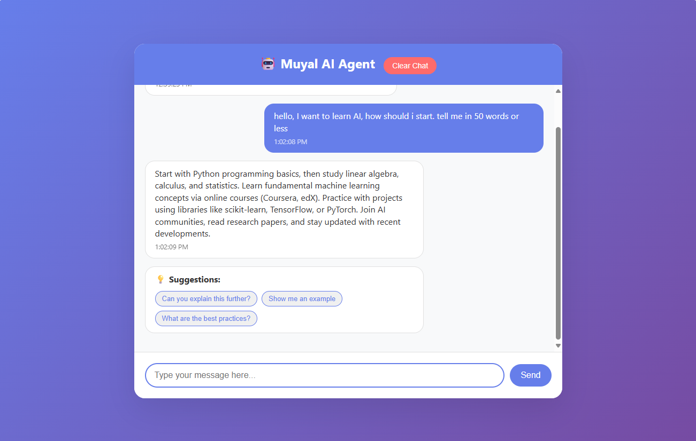
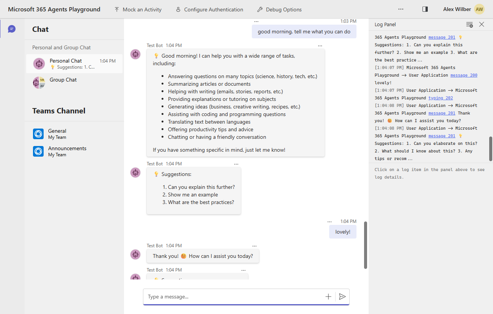

# 🐰 Muyal CEA (Conversational Experience Application)

A unified, multi-platform **Conversational Experience Application (CEA)** supporting **Microsoft 365**, **Web**, **Slack**, **Discord**, and more. Built with **6 AI provider options** including local AI, advanced observability, and a clean, extensible architecture.

## 🏢 Microsoft CEA vs Azure AI Foundry AI Agent

As a **Microsoft team**, we've built this as a **CEA (Conversational Experience Application)** - here's when to choose this approach:

### 🎯 **Use This CEA When:**
- **Multi-Platform Deployment**: Need one agent across Teams, Web, Slack, Discord
- **Custom Architecture**: Require specific business logic, routing, or integrations
- **Provider Flexibility**: Want to mix Azure OpenAI, Anthropic, Google AI, local models
- **Enterprise Control**: Need custom observability, cost tracking, compliance features
- **Development Learning**: Building conversational AI expertise in-house
- **Complex Workflows**: Multi-step processes, human handoffs, custom validation

```typescript
// CEA Approach (This Repository)
- Custom conversation logic and routing
- Multi-platform abstraction layer
- Flexible AI provider selection
- Enterprise observability and cost control
- Extensible architecture for business needs
```

## 🤔 Why "Muyal"? (The Rabbit Story)

**"Muyal"** means **"Rabbit"** in Tamil 🐰 - and there's a delightful reason behind this choice!

Just like rabbits, this AI agent is:
- **⚡ Lightning Fast**: Hops between AI providers faster than you can say "ChatGPT"
- **🔄 Multi-Platform**: Jumps seamlessly from Teams to Web to Slack (like rabbits hopping between gardens)
- **🌱 Reproduces Quickly**: One codebase, infinite platform adaptations (rabbits are known for... well, you know)
- **👂 Always Listening**: Those big ears aren't just for show - ready to respond on any platform
- **🏠 Adaptable**: Comfortable in any environment - cloud, local, enterprise, or your garage server
- **🥕 Loves Good Food**: Feeds on quality prompts and delivers even better responses

*Plus, "Muyal" sounds way cooler than "GenericAIBot2024" and definitely more professional than "RabbitGPT" 😄*

**Fun Fact**: In Tamil folklore, rabbits are considered clever problem-solvers who find creative solutions - exactly what this AI agent does when routing between 6 different AI providers! 🧠✨

[](https://github.com/microsoft/teams-toolkit)
[](#ai-providers)
[](#local-ai-support)
[](https://www.typescriptlang.org/)
[](https://nodejs.org/)
[](https://azure.microsoft.com/)
[](https://openai.com/)
[](https://www.anthropic.com/)
[](https://wandb.ai/)
[](https://ollama.ai/)
[](http://localhost:3978/api)
[](LICENSE)

## 🎯 What This Repository Showcases

This project demonstrates **modern AI application architecture** with enterprise-grade patterns and best practices. Perfect as a **starter template** for building production-ready AI agents that work across multiple platforms and AI providers.

### **🏗️ Architecture Patterns Demonstrated:**
- **Multi-Platform Abstraction**: Single codebase supporting Teams, Web, Slack, Discord through adapter pattern
- **AI Provider Abstraction**: Seamlessly switch between OpenAI, Anthropic, Azure OpenAI, Google AI, and local models
- **Observability-First Design**: Built-in W&B Weave tracing for cost tracking, performance monitoring, and conversation analytics
- **Configuration-Driven**: Environment-based provider selection and platform routing
- **Extensible Framework**: Template-based approach for adding new platforms and AI providers

### **🚀 Use This Repository As Your Starter For:**

**Enterprise AI Assistants:**
```typescript
// Production-ready patterns for business applications
- Multi-tenant AI agent deployments
- Compliance-first Azure OpenAI integration
- Cost tracking and optimization
- Team collaboration through Microsoft 365
```

**Multi-Platform Chatbots:**
```typescript
// One agent, multiple platforms
- Teams bot for internal collaboration
- Web interface for customer support  
- Slack integration for developer teams
- API endpoints for custom integrations
```

**AI Provider Flexibility:**
```typescript
// Mix and match AI providers by use case
- Azure OpenAI for sensitive enterprise data
- Anthropic Claude for creative tasks
- Local Ollama for development and privacy
- Google Gemini for cost-effective scale
```

**Observability & Cost Management:**
```typescript
// Enterprise-grade monitoring out of the box
- Real-time cost tracking across all providers
- Conversation-level performance analytics
- User feedback integration and quality metrics
- Provider reliability and failover monitoring
```

### **💡 Perfect Starting Point For:**
- **Enterprise AI Teams** building internal assistants
- **SaaS Companies** adding AI features to existing products  
- **Consultants** deploying client-specific AI solutions
- **Developers** learning modern AI application patterns
- **Startups** needing rapid AI prototype-to-production

## ⚡ Quick Start

### 1. Install Dependencies
```bash
git clone https://github.com/ushakrishnan/Muyal.git
cd Muyal
npm install
```

### 2. Configure AI Provider
Choose your preferred setup:

**Enterprise (Recommended):**
```bash
cp .env.example .env
# Add your Azure OpenAI credentials
AZURE_OPENAI_API_KEY=your-key
AZURE_OPENAI_ENDPOINT=https://your-resource.openai.azure.com/
AZURE_OPENAI_DEPLOYMENT_NAME=gpt-4o
```

**Privacy-First (Local AI):**
```bash
# Install Ollama: https://ollama.ai/
ollama pull llama3.2:3b
# Configure local AI
OLLAMA_ENABLED=true
OLLAMA_MODEL=llama3.2:3b
```

### 3. Start the Agent
```bash
# Quick start (recommended) - Auto-opens browser windows
npm start

# Alternative startup options
npm run start:muyal-simple     # Simple batch version (also opens browser)
npm run dev                    # Development mode with hot reload
scripts\start-muyal.ps1 -NoBrowser  # Skip automatic browser opening
```

🌐 **Web Interface**: http://localhost:3978  
🔗 **Microsoft 365**: http://localhost:56150  
📊 **W&B Weave Traces**: https://wandb.ai/[entity]/[project]/weave (if configured)

### 📸 Interface Examples

**Web Interface (localhost:3978)**


*Clean, responsive web chat interface for direct user interactions*

**Microsoft 365 Playground (localhost:56150)**


*Microsoft 365 Agents Playground for testing Teams integration and M365 Copilot features*

**Startup Features:**
- **Auto-cleanup**: Terminates existing processes
- **Configuration validation**: Checks for AI provider setup  
- **Dual-service**: Starts both web interface and M365 playground
- **Auto-browser**: Automatically opens both interfaces in your browser
- **Smart timing**: Waits for services to initialize before opening URLs
- **Clear feedback**: Shows startup progress and URLs

## 🎯 AI Providers

Choose from **6 AI providers** to match your needs:

| Provider | Models | Best For | Setup Time |
|----------|--------|----------|------------|
| **Azure OpenAI** | GPT-4o, GPT-4 | Enterprise, compliance | 2 min |
| **OpenAI** | GPT-4o, GPT-4, GPT-3.5 | General purpose | 1 min |
| **Anthropic** | Claude-3 Sonnet, Haiku | Creative writing, analysis | 1 min |
| **Google AI** | Gemini Pro, Flash | Fast responses, cost-effective | 1 min |
| **Azure AI Foundry** | Llama 2, Mistral, Phi-3 | Open models, flexibility | 3 min |
| **Ollama** | Local models | Privacy, offline, no costs | 5 min |

## 🌐 Platform Support

### Current Platforms
- ✅ **Microsoft 365** (Teams, Copilot integration)
- ✅ **Web Interface** (Direct chat)
- ✅ **REST API** (Programmatic access)

### Extensible Architecture
- � **Slack** (Template ready)
- 🔜 **Discord** (Template ready)
- 🔜 **Telegram** (Template ready)
- 🔜 **WhatsApp** (Template ready)

## 🏗️ Architecture

```
Platform Interfaces (Web, M365, Slack...)
           ↓
Platform Adapters (Message transformation)
           ↓
Conversation Handler (Central processing)
           ↓
AI Processor (Provider selection)
           ↓
AI Providers (OpenAI, Anthropic, Ollama...)
```

**Key Benefits:**
- 🔧 **Modular**: Add platforms and providers easily
- 🔄 **Flexible**: Mix different AI providers per platform
- 🛡️ **Reliable**: Automatic fallbacks and health monitoring
- 🔒 **Secure**: Local AI options for sensitive data

## 🔧 Local AI Support

**Complete Privacy & Cost Control:**

```bash
# Install Ollama
curl -fsSL https://ollama.ai/install.sh | sh

# Pull AI models
ollama pull llama3.2:3b      # Fast, general use
ollama pull codellama:13b    # Code generation
ollama pull mistral          # Balanced performance

# Configure Muyal
OLLAMA_ENABLED=true
OLLAMA_MODEL=llama3.2:3b
M365_AI_PROVIDER=ollama-default
WEB_AI_PROVIDER=ollama-default
```

**Benefits:**
- 🔒 **Complete Privacy**: Data never leaves your network
- 💰 **Zero API Costs**: No per-request charges
- ⚡ **Always Available**: Works offline
- 🛠️ **Development Friendly**: Perfect for testing

## 🚀 Use Cases

### Enterprise Deployment
```bash
# Maximum compliance and reliability
AZURE_OPENAI_API_KEY=your-key
M365_AI_PROVIDER=azure-openai-default
WEB_AI_PROVIDER=azure-openai-default
```

### Multi-Provider Flexibility
```bash
# Different AI for different platforms
M365_AI_PROVIDER=azure-openai-default    # Enterprise compliance
WEB_AI_PROVIDER=anthropic-default        # Creative conversations
SLACK_AI_PROVIDER=google-ai-default      # Fast responses
```

### Development & Testing
```bash
# Local AI for development, cloud for production
OLLAMA_ENABLED=true
WEB_AI_PROVIDER=ollama-default           # Development
M365_AI_PROVIDER=azure-openai-default   # Production
```

## 📊 API Endpoints

### Chat Interface
```bash
POST /api/chat
{
  "message": "Hello, how can you help me?",
  "conversationId": "user-123"
}
```

### Health & Monitoring
```bash
GET /api/health              # System health
GET /api/ai/health           # AI provider status
GET /api/ai/config           # Current configuration
POST /api/feedback           # Collect user feedback
```

## 📁 Project Structure

```
Muyal/
├── src/
│   ├── core/                # Business logic
│   │   ├── conversation-handler.ts
│   │   ├── ai-processor.ts
│   │   └── providers/       # AI provider implementations
│   ├── adapters/            # Platform integrations
│   │   ├── base/
│   │   ├── microsoft365/
│   │   ├── web/
│   │   └── _template/       # New platform template
│   ├── services/            # Shared services
│   │   ├── observability/   # W&B integration, metrics tracking
│   │   ├── analytics/       # Usage analytics
│   │   └── formatting/      # Message formatting
│   ├── api/                 # REST API routes
│   └── index.ts             # Application entry point
├── docs/                    # Documentation
│   ├── ARCHITECTURE.md      # Unified system architecture
│   ├── SETUP_AND_USAGE.md   # Complete setup & observability
│   └── TROUBLESHOOTING.md   # Common issues & solutions
├── appPackage/              # Microsoft 365 app manifest
├── .env.example             # Environment template (main folder)
└── infra/                   # Azure deployment configs
```

## 🛠️ Development

### Add New Platform
1. Copy `src/adapters/_template/` to `src/adapters/your-platform/`
2. Implement platform-specific message handling
3. Register in adapter registry
4. Configure AI provider mapping

### Add New AI Provider
1. Create `src/core/providers/your-provider.ts`
2. Implement `AIProvider` interface
3. Add configuration to `ai-configuration.ts`
4. Update environment variables

## 📚 Documentation

- **[Setup & Usage Guide](docs/SETUP_AND_USAGE.md)** - Complete configuration, usage, and observability setup
- **[Architecture Guide](docs/ARCHITECTURE.md)** - Unified system architecture and design patterns
- **[Troubleshooting Guide](docs/TROUBLESHOOTING.md)** - Common issues and solutions

## 🔍 Observability & Monitoring

### Built-in Analytics
- ✅ **Provider Health Monitoring**: Real-time status of all AI providers
- ✅ **Request Tracking**: Count, errors, response times via W&B integration
- ✅ **Cost Estimation**: Track spending across providers with detailed analytics
- ✅ **API Health Endpoints**: `/api/health`, `/api/ai/health`, `/api/feedback`

### W&B Weave Tracing (Default)
Built-in W&B Weave integration provides AI-native observability with free tier:

```bash
# Setup (included in dependencies)
WANDB_ENABLED=true
WANDB_API_KEY=your-api-key
WANDB_PROJECT=muyal-ai-agent
WANDB_ENTITY=your-username
```

**AI Tracing Features:**
- � **Complete Conversation Traces**: Full prompt/response chains with metadata
- 💰 **Token & Cost Tracking**: Real spending across all providers with detailed breakdowns
- ⚡ **Performance Analytics**: Response times, error rates, provider comparison
- 👤 **User Feedback Integration**: Quality ratings linked to specific conversations
- 🎯 **Model Performance**: Side-by-side provider comparison and optimization insights
- � **Weave Dashboard**: Purpose-built AI application observability at https://wandb.ai/[entity]/[project]/weave

### Alternative Options
Swappable observability providers for different needs:

```bash
# Option 1: LangFuse (Open source, self-hosted)
npm install langfuse

# Option 2: Prometheus + Grafana (Custom metrics)
# See observability section in: docs/SETUP_AND_USAGE.md
```

**📖 See:** [Setup & Usage Guide](docs/SETUP_AND_USAGE.md) • [Architecture Overview](docs/ARCHITECTURE.md)

## 🤝 Contributing

1. Fork the repository
2. Create your feature branch: `git checkout -b feature/amazing-feature`
3. Commit your changes: `git commit -m 'Add amazing feature'`
4. Push to the branch: `git push origin feature/amazing-feature`
5. Open a Pull Request

## 📄 License

This project is licensed under the MIT License - see the [LICENSE](LICENSE) file for details.

## 🆘 Support

- 📖 Check the [Setup Guide](docs/SETUP_AND_USAGE.md) for common issues
- 🔍 View [API health endpoints](#api-endpoints) for debugging
- 🐛 Create an issue for bugs or feature requests

---

**Ready to get started?** Follow the [Quick Start](#quick-start) guide above! 🚀